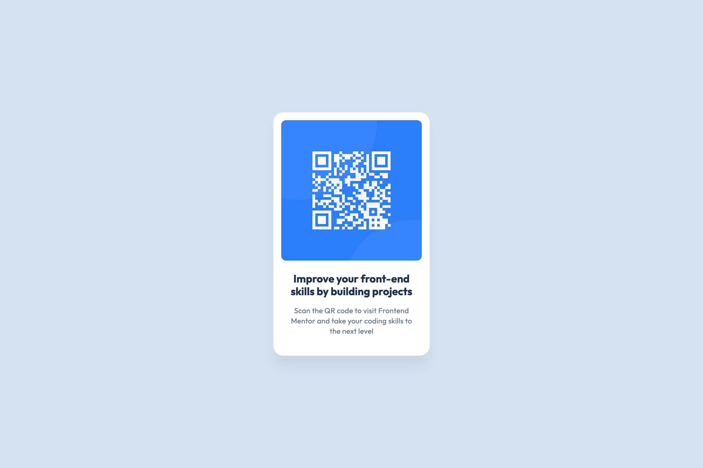

# Frontend Mentor - QR code component solution

This is a solution to the [QR code component challenge on Frontend Mentor](https://www.frontendmentor.io/challenges/qr-code-component-iux_sIO_H). Frontend Mentor challenges help you improve your coding skills by building realistic projects.

## Table of contents

- [Overview](#overview)
  - [Screenshot](#screenshot)
  - [Links](#links)
- [My process](#my-process)
  - [Built with](#built-with)
  - [What I learned](#what-i-learned)
  - [Continued development](#continued-development)
- [Author](#author)

## Overview

### Screenshot

### Links

<!-- Todo -->

- Solution URL: [Add solution URL here](https://www.frontendmentor.io/solutions/pixel-perfect-qr-code-component-challenge-KrBFHviT-d)
- Live Site URL: [QR code component live](https://danijel374.github.io/fem-qr-code-component/)

## My process

Think about it for a bit before starting to code

### Built with

- Semantic HTML5 markup
- CSS custom properties
- BEM
- Flexbox
- CSS Grid
- Mobile-first workflow

### What I learned

I can't think anything particular this was simple first challenge on frontend mentor

### Continued development

Focusing on responsive design and trying to achive pixel almost perfect,using figma and Pixel Perfect Pro extention for the task.

## Author

- Frontend Mentor - [@danijel374](https://www.frontendmentor.io/profile/danijel374)
- Twitter - [@danijel3741](https://www.twitter.com/danijel3741)
